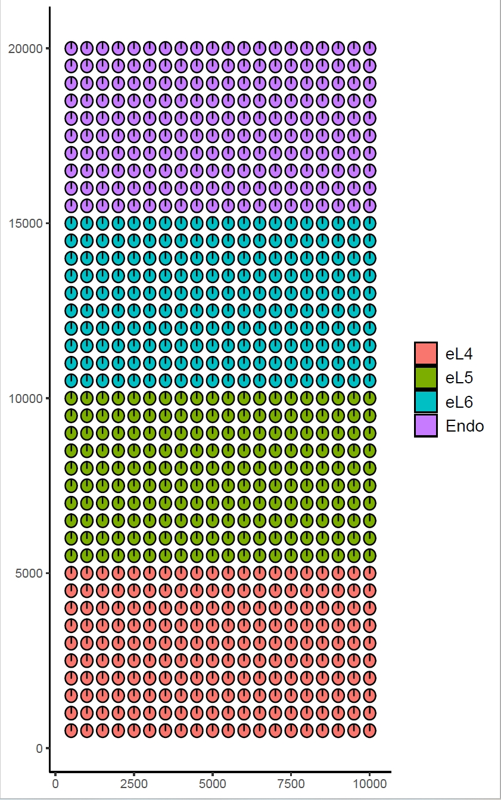
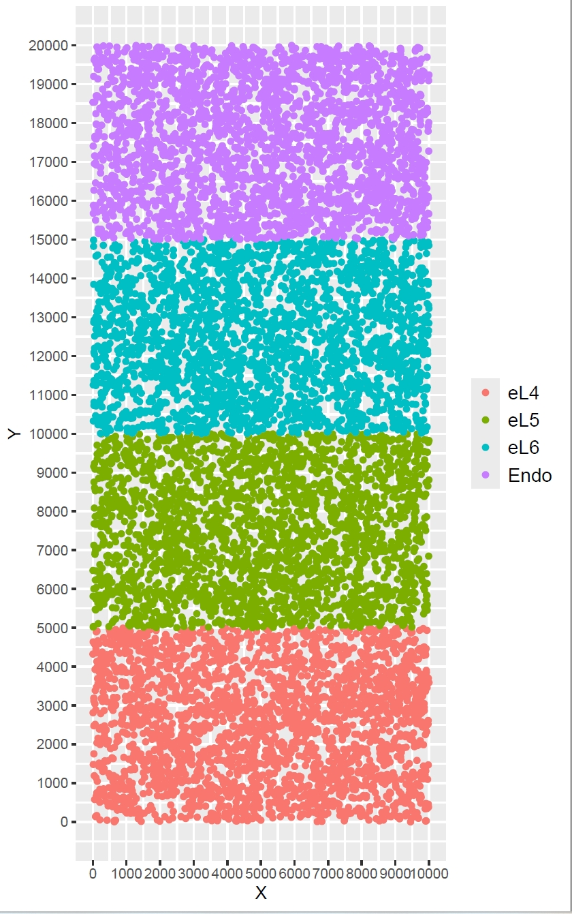
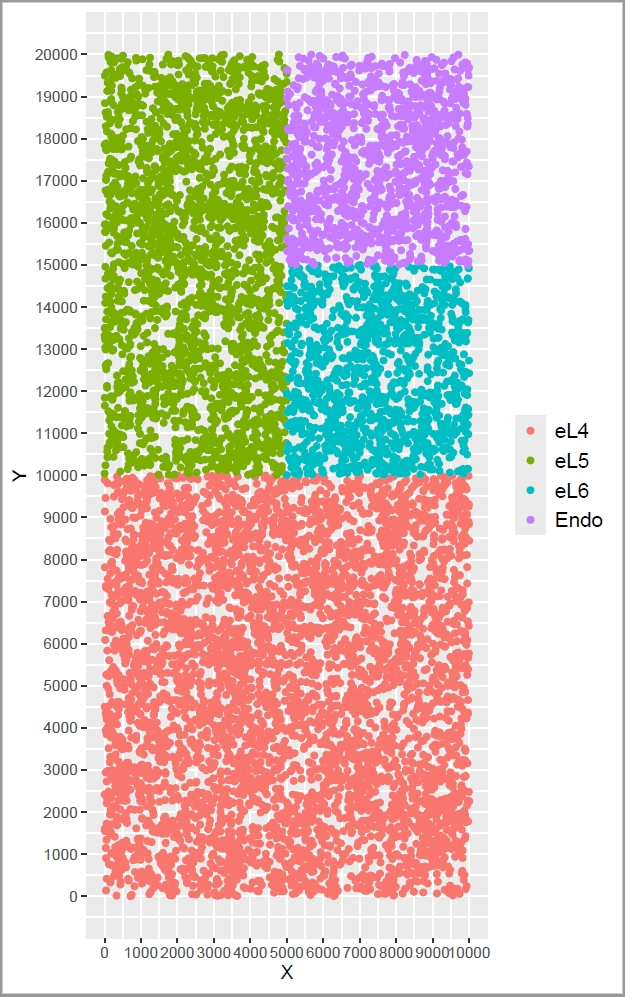
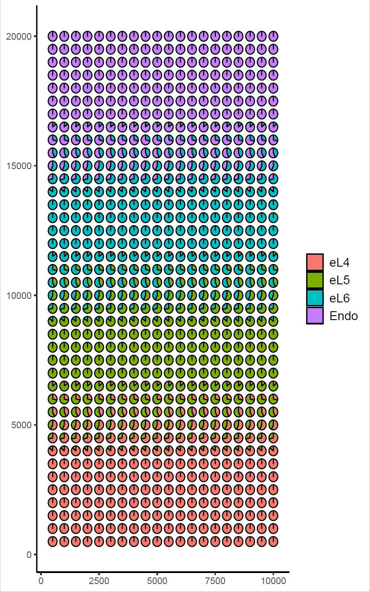
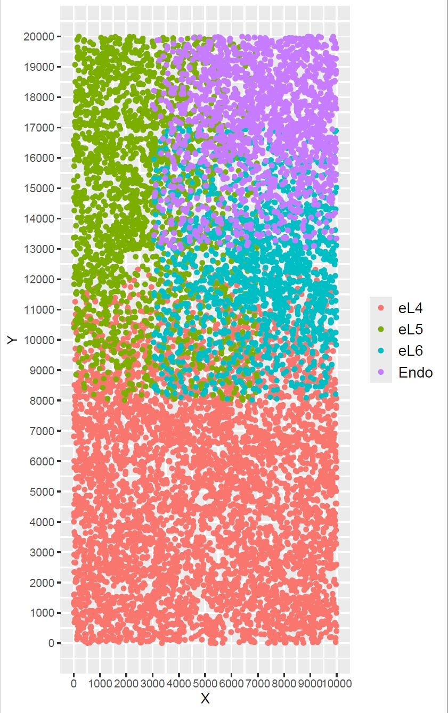

# **Section1:Overview**  
This document provides details on how to use the functions for generating various types of simulated spatial transcriptomics data, including descriptions of the specific code and parameter meanings for each data type, as well as instructions on generating simulated SRT data from custom scRNA-seq and STARmap data.  
#
# **Section2:Installation**  
SSTD is based on R and can be easily installed on Windows, Linux as well as MAC OS.  
First, users should install R >= 4.1.0.  
Next, install devtools and SSTD.  
## ***2.1 Install the ggplot2 package and scatterpie package:***  
Make sure you have R and the necessary packages installed. The key packages used in these functions include 'ggplot2' and 'scatterpie'.  
```r
install.packages(c("ggplot2", "scatterpie"))

#load the packages  
library(ggplots)  
library(scatterpie)  
```
## ***2.2 Install the SSTD package from GitHub:***  
```r
if (!requireNamespace("devtools", quietly = TRUE)) {  
    install.packages("devtools")  
}  
devtools::install_github("YourUsername/SSTD")

#load the SSTD package
library(SSTD)  
```
#
# **Section3:Usage**
## **3.1 Generate Simulated Data**  
### ***3.1.1 Function: 'org_data_space'***  
This function processes input metadata and gene count files, selects specific clusters, and saves the processed data as a CSV file.  
### ****Parameters****:  
  * 'meta_data_file': Path to the metadata CSV file.  
  * 'gene_count_file': Path to the gene count CSV file.  
  * 'output_csv_file': Path to save the processed data as a CSV file.  
  * 'selected_clusters': A vector specifying the clusters to select from the data.  
### ***Example***:  
```r
org_data_space("path/to/meta_data.csv", "path/to/gene_count.csv", "processed_data.csv", c("Cluster1", "Cluster2"))
```
###
### ***3.1.2 Function: 'spatial_spot_true_prop'***  
This function generates synthetic spatial spot true proportions data for a grid of spots.  
### ***Parameters***:  
  * 'cell_types': A vector specifying the cell types.  
  * 'filename': The filename to save the generated data.  
### ***Example***:  
```r
spatial_spot_true_prop(c("eL4", "eL5", "eL6", "Endo"), "spatial_spot_true_prop.csv")  
```
###
### ***3.1.3 Function: 'spatial_spot_loc'***  
This function generates spatial spot location data for a 20x40 grid of spots.  
### ***Parameters***:  
  * 'filename': The filename to save the generated data.  
### ***Example***:  
```r
spatial_spot_loc("spatial_spot_loc.csv")  
```
###
### ***3.1.4 Function: 'spatial_spot_nUMI'***  
This function calculates the total nUMI for all specified cell types and writes the result to CSV files.  
### ***Parameters***:  
  * 'sim_spatial_spot_true_prop_data': Data frame containing spatial spot true proportions data.  
  * 'result_matrices': List of matrices representing the cell counts for each cell type.  
  * 'cluster_names': List of names of the cell types.  
  * 'org_data': Original data frame containing cluster information.  
  * 'prefix': Optional prefix for the output filenames.  
### ***Example***:  
```r
spatial_spot_nUMI(sim_spatial_spot_true_prop_data, list(matrix1, matrix2, matrix3, matrix4), c("CellType1", "CellType2", "CellType3", "CellType4"), org_data, "output")  
```
###
### ***3.1.5 Function: 'result_matrix'***  
This function takes a combined array representing the spatial distribution of cells and calculates the cell counts within each spot.  
### ***Parameters***:  
  * 'combined_array': A matrix representing the spatial distribution of cells.  
### ***Example***:  
```r
result_matrix(combined_array)  
```
###
### ***3.1.6 Function: 'generate_plots_and_save'***  
This function generates plots of cell locations with a grid and a pie chart of cell type proportions and saves the plots as PDF files.  
### ***Parameters***:  
  * 'combined_arrays': A list containing matrices of data for each cell type.  
  * 'include_celltypes': A vector indicating which cell types to include.  
  * 'new_data': Data frame containing new data with spatial coordinates.  
  * 'sim_spatial_spot_true_prop_data': Data frame containing spatial spot true proportions data.  
  * 'prefix': Optional prefix for the output filenames.  
### ***Example***:  
```r
generate_plots_and_save(combined_arrays, c("CellType1", "CellType2"), new_data, sim_spatial_spot_true_prop_data, "output")  
```
##
## **3.2 Generate Gradient Arrays**  
### ***3.2.1 Function: 'get_gradation_2d'***  
This function generates a 2D gradient array matrix based on specified parameters.  
### ***Parameters:***  
  * 'start': The starting value for the sequence.  
  * 'stop': The ending value for the sequence.  
  * 'width': The number of columns in the matrix.  
  * 'height': The number of rows in the matrix.  
  * 'is_horizontal': Logical value indicating whether the matrix should be horizontal (TRUE) or vertical (FALSE).  
### ***Example:***  
```r
get_gradation_2d(0, 1, 20, 40, TRUE)  
```
### ***3.2.2 Function: 'get_gradation_3d'***  
This function generates a 3D gradient matrix where each matrix represents a gradient in one dimension.  
### ***Parameters:***  
  * 'width': The width of the matrices.  
  * 'height': The height of the matrices.  
  * 'start_list': A list of starting values for the gradients.  
  * 'stop_list': A list of ending values for the gradients.  
  * 'is_horizontal_list': A list of logical values indicating whether the gradient direction for each dimension is horizontal.  
### ***Example:***  
```r
get_gradation_3d(20, 40, c(0, 0, 0), c(1, 1, 1), c(TRUE, FALSE, TRUE))  
```
##
## **3.3 Combine Arrays**  
### ***3.3.1 Function: 'combined_arrays'***  
This function creates a list of combined arrays based on the selected clusters and corresponding data matrices.  
### ***Parameters:***  
  * 'selected_clusters': A vector containing the names of selected clusters.  
  * 'celltype1': A matrix containing data for cell type 1.  
  * 'celltype2': A matrix containing data for cell type 2.  
  * 'celltype3': A matrix containing data for cell type 3.  
  * 'celltype4': A matrix containing data for cell type 4.  
### ***Example:***  
```r
combined_arrays(c("Cluster1", "Cluster2"), matrix1, matrix2, matrix3, matrix4)  
```
#
# **Section4: 'generate_type1_data'**  
## ***4.1 Description***  
This function processes the input data files, generates synthetic spatial spot true proportions and locations, creates gradation arrays for specified cell types, calculates nUMI counts, and generates and saves plots.  
.<div align=center></div>.<div align=center></div>  
##
## ***4.2 Parameters***  
  * 'meta_data_file': Path to the metadata file (CSV format).  
  * 'gene_count_file': Path to the gene count file (CSV format).  
  * 'selected_clusters': A named vector specifying the clusters to include (e.g., c(celltype1="eL4",   celltype2="eL5", celltype3="eL6", celltype4="Endo")).  
  * 'prefix': Prefix for the output CSV files.  
##
## ***4.3 Returns***  
  * 'NULL': The function performs operations and saves results to files but does not return a value.  
##
## ***4.4 Examples***  
```r
prefix = "type_one"  
source("R/utilities.R")  
meta_data_file <- system.file(package="SSTD", "extdata", "meta_data.csv")  
gene_count_file <- system.file(package="SSTD", "extdata", "gene_count.csv")  
selected_clusters <- c(celltype1="eL4", celltype2="eL5", celltype3="eL6", celltype4="Endo")  
generate_type1_data(meta_data_file, gene_count_file, selected_clusters, "type_one")  
```  
##
## ***4.5 Step-by-Step Usage***  
### ***4.5.1 Prepare Metadata and Gene Count Files:***  
Ensure the metadata and gene count data are in CSV format and specify the file paths.  
### ***4.5.2 Generate Type 1 Data:***  
Use the generate_type1_data function to process the data and generate results.  
```r
generate_type1_data(meta_data_file, gene_count_file, selected_clusters, prefix)  
```  
##
## ***4.6 Details of the Function***  
### ***4.6.1 Process Original Data:***  
* 'org_data_space' reads the metadata and gene count files, filters data based on selected clusters, and saves the processed data.  
```r
org_data <- org_data_space(meta_data_file, gene_count_file, output_csv_file = paste0(prefix, "_org_data_space.csv"), selected_clusters)  
```
### ***4.6.2 Generate Spatial Spot True Proportions:***  
* 'spatial_spot_true_prop' creates spatial spot true proportions data for the selected clusters and saves it.  
```r
sim_spatial_spot_true_prop_data <- spatial_spot_true_prop(selected_clusters, filename = paste0(prefix, "_spatial_spot_true_prop.csv"))  
```
### ***4.6.3 Generate Spatial Spot Locations:***  
* 'spatial_spot_loc' generates spatial spot locations and saves the data.  
```r
spatial_spot_loc(filename = paste0(prefix, "_spatial_spot_loc.csv"))  
```
### ***4.6.4 Generate Gradation Arrays:***
* 'get_gradation_2d' generates 2D gradation arrays for each cell type.  
```r
# celltype1  
array <- get_gradation_2d(1, 1,  10, 20, TRUE)  
array_1 <- get_gradation_2d(0, 0,  30, 20, TRUE)  
get_gradation_2d_celltype1 <- rbind(array, array_1)  
# celltype2  
array <- get_gradation_2d(0, 0,  10, 20, TRUE)  
array_0 <- get_gradation_2d(1, 1,  10, 20, TRUE)  
array_1 <- get_gradation_2d(0, 0,  20, 20, TRUE)  
get_gradation_2d_celltype2 <- rbind(array, array_0)  
get_gradation_2d_celltype2 <- rbind(get_gradation_2d_celltype2, array_1)  
# celltype3  
array <- get_gradation_2d(0, 0,  10, 20, TRUE)  
array_0 <- get_gradation_2d(1, 1,  10, 20, TRUE)  
array_1 <- get_gradation_2d(0, 0,  20, 20, TRUE)  
get_gradation_2d_celltype3 <- rbind(array_1, array_0)  
get_gradation_2d_celltype3 <- rbind(get_gradation_2d_celltype3, array)  
# celltype4  
array <- get_gradation_2d(1, 1,  10, 20, TRUE)  
array_1 <- get_gradation_2d(0, 0,  30, 20, TRUE)  
get_gradation_2d_celltype4 <- rbind(array_1, array)  
```
### ***4.6.5 Calculate nUMI Counts:***  
* 'spatial_spot_nUMI' calculates the total nUMI counts for all cell types and saves the results.  
```r
result_matrices <- list(result_matrix(get_gradation_2d_celltype1),  
                        result_matrix(get_gradation_2d_celltype2),  
                        result_matrix(get_gradation_2d_celltype3),  
                        result_matrix(get_gradation_2d_celltype4))  
new_data <- spatial_spot_nUMI(sim_spatial_spot_true_prop_data, result_matrices, selected_clusters, org_data, prefix)  
```
### ***4.6.6 Generate and Save Plots:***  
* 'generate_plots_and_save' generates and saves plots of cell locations and proportions.  
```r
combined_arrays <- list(selected_clusters, get_gradation_2d_celltype1,  
                        get_gradation_2d_celltype2,  
                        get_gradation_2d_celltype3,  
                        get_gradation_2d_celltype4)  
generate_plots_and_save(combined_arrays, selected_clusters, new_data, sim_spatial_spot_true_prop_data, prefix)
```
#
# **Section5: 'generate_type2_data'**    
## ***5.1 Description***    
The generate_type2_data function simulates spatial transcriptomics data, which is essential for studying gene expression within a spatial context. The function performs the following steps:  
.<div align=center></div>.<div align=center></div>
### ***5.1.1 Processes Input Data:***   
Reads and filters the metadata and gene count files based on the selected clusters.  
### ***5.1.2 Generates Spatial Spot True Proportions:***  
Simulates the true proportions of different cell types in spatial spots.  
### ***5.1.3 Creates Spatial Spot Locations:***  
Generates spatial coordinates for each spot.  
### ***5.1.4 Generates Gradation Arrays for Each Cell Type:***  
Creates 2D gradation patterns to model the spatial distribution of each cell type.  
### ***5.1.5 Calculates nUMI Counts:***  
Computes the number of unique molecular identifiers (nUMIs) for each spot, reflecting the abundance of gene transcripts.  
### ***5.1.6 Generates and Saves Plots:***  
Creates visual representations of the spatial distribution and proportions of cell types.  
###
The output includes several CSV files containing the simulated data and plots illustrating the spatial patterns of cell types and gene expression.  
.  
#
# **Section6: 'generate_type3_data'**    
## ***6.1 Description***    
The generate_type3_data function simulates spatial transcriptomics data for selected clusters with a distinct gradation pattern compared to other types. This function is designed to capture complex spatial relationships in gene expression data.  
.<div align=center></div>.<div align=center></div>
#
# **Section7: 'generate_type4_data'**    
## ***7.1 Description***    
The generate_type3_data function simulates spatial transcriptomics data for selected clusters with a distinct gradation pattern compared to other types. This function is designed to capture complex spatial relationships in gene expression data.   
.<div align=center></div>.<div align=center></div>
#
# **Section8:Using Custom scRNA-seq and STARmap Data to Generate Simulated SRT Data**  
**This guide provides a step-by-step process for generating simulated spatial transcriptomics (SRT) data using custom single-cell RNA sequencing (scRNA-seq) data and spatial transcriptomics data. The simulation is performed using the Generating_simulation_data function from the R programming environment.**  
## ***8.1 Data Preparation***  
Prepare your data in the following formats:  
  * **Spot Spatial Count:** A matrix of gene expression counts for each cell, similar to the example provided in the function documentation.  
  * **Simulated Spatial Spot Location:** A table with the spatial coordinates (X and Y) for each spot.  
  * **Cell Cell Type:** A table with the cell type information, including cluster IDs and cell type names.    
###
Ensure that your data files have the correct column names as specified in the function parameters.  
##
## ***8.2 Usage***  
### ***8.2.1 Define the paths to your data files:***   
```r
spot_spatial_count_path <- "path/to/your/spot_spatial_count.txt"  
sim_spatial_spot_loc_path <- "path/to/your/sim_spatial_spot_loc.txt"  
cell_celltype_path <- "path/to/your/cell_celltype.txt"  
```
### ***8.2.2 Set the grid interval for spatial analysis and a prefix for the output files:***  
```r
grid_interval <- 500  # Adjust based on your spatial resolution  
prefix <- "my_simulation"  # Prefix for the output files  
```
### ***8.2.3 Call the Generating_simulation_data function with your data and parameters:***  
```r
Generating_simulation_data(  
  spot_spatial_count = spot_spatial_count_path,  
  sim_spatial_spot_loc = sim_spatial_spot_loc_path,  
  cell_celltype = cell_celltype_path,  
  grid_interval = grid_interval,  
  prefix = prefix  
)  
```
### ***8.2.4 The function will generate several output files with the specified prefix, including simulated gene expression data, spatial locations, cell type proportions, and more.***  
##  
## ***8.3 Output Files***  
  * **_sim_spatial_spot_nUMI.csv:** Simulated gene expression data for pseudo-spots.  
  * **_sim_spatial_spot_loc.csv:** Physical locations of simulated pseudo-spots.  
  * **_sim_spatial_spot_true_prop.csv:** True cell type proportions of simulated pseudo-spots.  
  * **_cells_nUMI.csv:** Gene expression data of spot cells.  
  * **_cells_celltype.csv:** Cell type annotation of spot cells.
##
## ***8.4 Visualization***  
The function also generates visualizations such as:  
  * **_plot_Locations_of_cell_with_grid.pdf:** Plot showing the locations of cells with a grid overlay.  
  * **_Pie_chart_of_cell_type_proportions.pdf:** Pie chart representing cell type proportions.  
##
## ***8.5 Notes***  
  * Ensure that your data files are correctly formatted and have the necessary column names.  
  * Adjust the grid_interval parameter based on the spatial resolution of your data.  
  * Customize the prefix to organize your output files as needed.  
# **Section8:Reference**  
#
# **Section9:Citation**  
